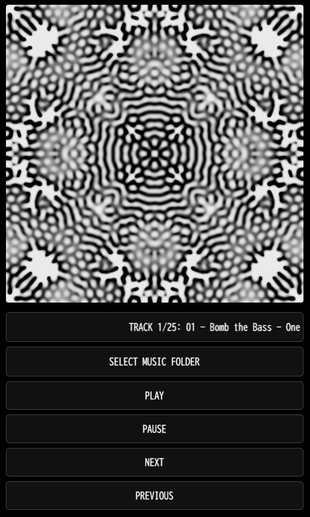

# Gray-Scott Visualizer (Minimal Fade-In)

音楽に合わせて生成される **Gray-Scott 反応拡散パターン** をリアルタイムに可視化する Web アプリです。  
ブラウザだけで動作し、GitHub Pages から簡単に公開・体験できます。  
📱 **PWA対応 (iPhone / Android / PC 全対応確認済み)** — スマホやPCにインストールしてアプリのように使えます！

---

## 特長
- 🎶 **音楽入力対応** — ローカルの音楽ファイルを読み込み、音の特徴量（RMS、スペクトル重心など）に反応  
- 🌊 **リアルタイム生成** — Gray-Scott 反応拡散モデルでパターンが進化  
- 🖼️ **インタラクティブ** — クリックでフィード／キル値にフラッシュ効果  
- 📱 **クロスプラットフォーム対応** — PC / Android / iOS (Safari) で利用可能  
- 🧩 **PWA対応** — GitHub Pagesから直接インストール可能  

---

## インストール方法（PWA）
1. デモページを開く  
   👉 [https://masato-nasu.github.io/Gray-Scott-Visualizer/](https://masato-nasu.github.io/Gray-Scott-Visualizer/)  
2. **PC (Chrome/Edge)**：URLバー右端の「インストール」アイコンをクリック  
3. **Android (Chrome)**：メニュー「…」→「インストール」または「ホーム画面に追加」  
4. **iOS (Safari)**：共有ボタン →「ホーム画面に追加」  

---

## 制約について（重要）
- このアプリは **PWA（ブラウザアプリ）** として動作します  
- そのため **バックグラウンド再生は不可** です  
- 画面を閉じたり、別アプリに切り替えると音声は停止します  

---

## スクリーンショット

---

## デモページ

https://masato-nasu.github.io/Gray-Scott-Visualizer/

---

## 使い方
1. 「SELECT MUSIC FOLDER / FILES」から音楽ファイルをまとめて読み込み  
   - **PC**：フォルダを選択（サブフォルダ内も再帰的に読み込み）  
   - **Android**：フォルダ相当のディレクトリ選択が可能  
   - **iPhone/iPad**：ファイルアプリからフォルダを開き、中の曲をまとめて選択可能（フォルダ単位で扱える体験）  
2. **PLAY** で再生開始  
3. **PAUSE / NEXT / PREVIOUS** で操作可能  
4. キャンバスをクリックするとパターンが一時的に変調  

---

## 開発環境
- HTML / CSS / JavaScript  
- [Meyda](https://meyda.js.org/) (音声特徴量抽出ライブラリ)  

---

## 公開方法
1. このリポジトリを作成し、`index.html` と `screenshot.png` をアップロード  
2. GitHub → **Settings → Pages** から `main` ブランチを root で公開  
3. 数分後に `https://ユーザー名.github.io/リポジトリ名/` でアクセス可能  

---

## ライセンス
MIT License
